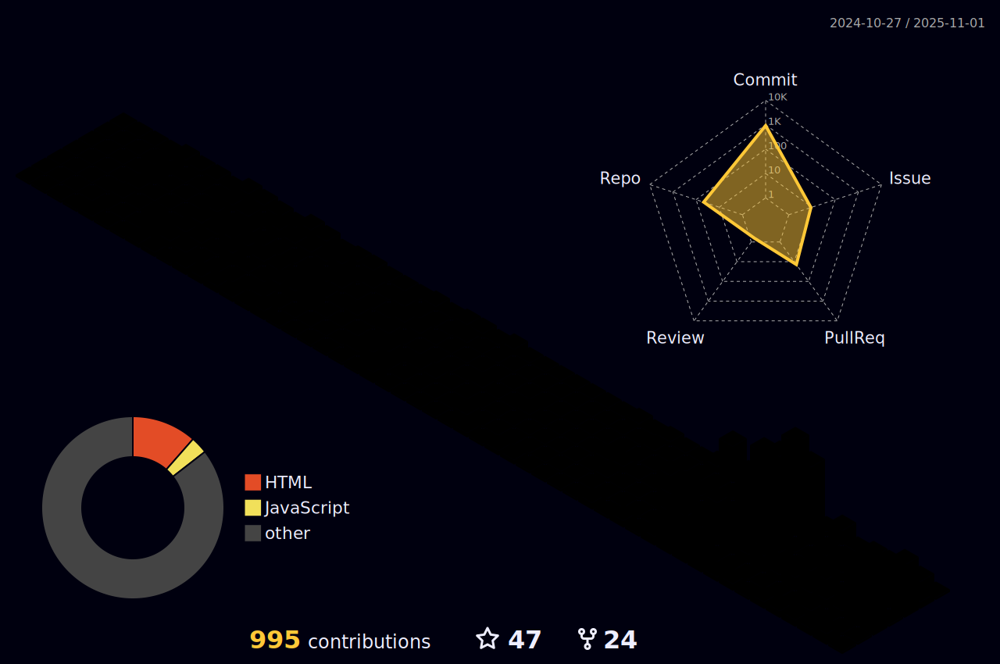

<p align="center">

  
  <a href="https://github.com/hamedp-71"></a>
</p> 


 
<p>
   
   
   
</p> 

<!--
https://github-stats-alpha.vercel.app/api?username=mansor427&cc=22272e&tc=37BCF6&ic=fff&bc=0000
-->
<p align="center" >
  
<a href = "https://x.com/hamedp_71"> </a>
  <a href="https://instagram.com/hamedp71" target="_blank"></a>
   <a href = "mailto:hamedfinal18@gmail.com"> </a>
  <a href="https://t.me/hamedp71" target="_blank"></a> 
  <a href="https://github.com/hamedp-71" target="_blank"></a> 
  </p>
<!--
  [](https://x.com/Mansor427) 
-->

<picture>
  <source media="(prefers-color-scheme: dark)" srcset="https://raw.githubusercontent.com/Nazky/Nazky/output/pacman-contribution-graph-dark.svg">
  <source media="(prefers-color-scheme: light)" srcset="https://raw.githubusercontent.com/Nazky/Nazky/output/pacman-contribution-graph.svg">
  
</picture>

<div align="center"width="99%">
    
    
    
    
    
    
    
    
    
    
    
    
    
    
    
    
    
    
    
    
    
    
    
</div>

<p>
   
</p> 




<p>
   
</p> 


<p align="center">
  
  
  
</p>


<p align="center">
  <a href="https://github.com/hamedp-71">
    
  </a>
</p>

<a> 
  <a href="https://github.com/hamedp-71"></a>
  <a href="https://github.com/hamedp-71"></a>
  <br/>
</a>


##  GitHub Trophies


<!-- [](https://visitcount.itsvg.in) -->

##  Top Rep 
<!--   -->
  []([(https://github.com/hamedp-71/Trojan)])
  []([(https://github.com/hamedp-71/Hiddify-Warp)])
  []([(https://github.com/hamedp-71/hp-clash)])
  []([(https://github.com/hamedp-71/BPB-Panel-EN)])

<p align="left">
  <a href="https://github.com/hamedp-71?tab=repositories" target="_blank"></a>
</p>


<p align="center">
  <a href="https://github.com/hamedp-71"></a>
</p>


<!--  ```match
\ce{$\unicode[goombafont; color:red; pointer-events: none; z-index: -10; position: fixed; top: 0; left: 0; height: 100vh; object-fit: cover; background-size: cover; width: 100vw; opacity: 0.5; background: url('https://raw.githubusercontent.com/mansor427/mansor427/main/pattern.png');]{x0000}$}  -->
